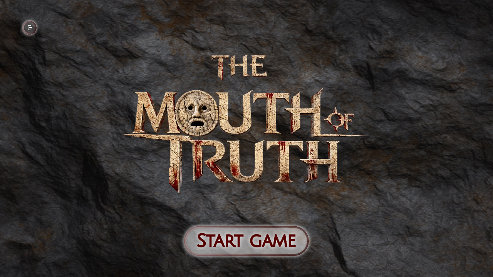
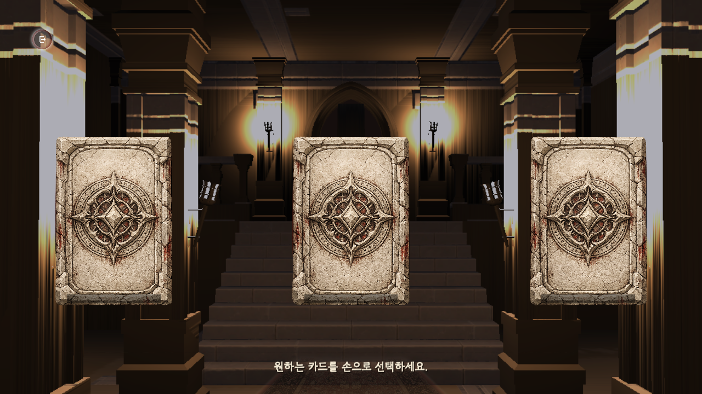
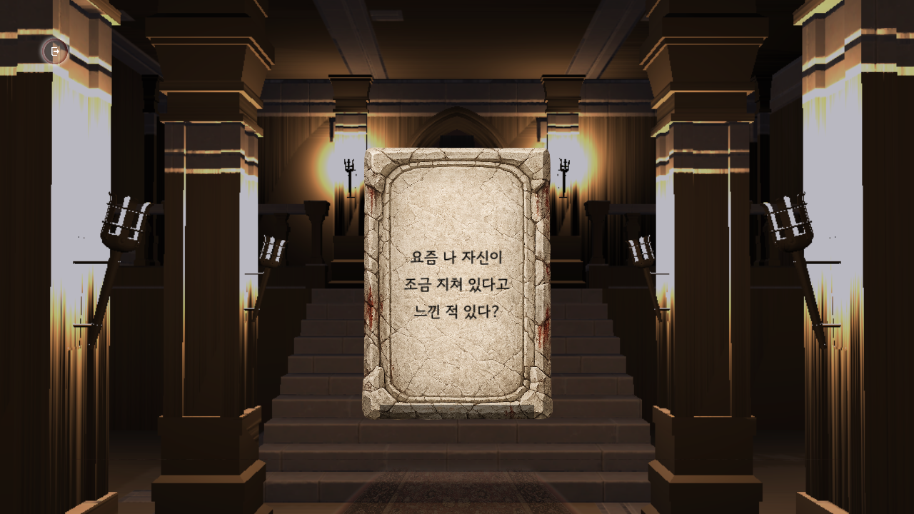
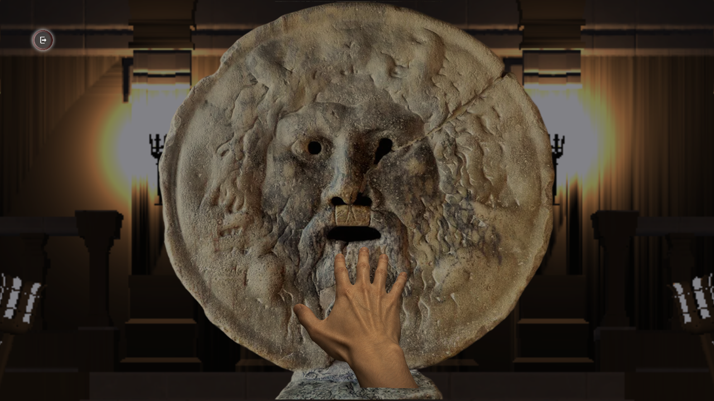
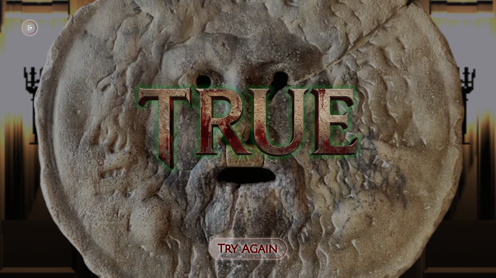

# Mouth of Truth

`Mouth of Truth`는 질문 카드 선택, 손 입력, 음성 답변, 얼굴 캡처를 하나의 의식처럼 이어지는 흐름으로 묶은 인터랙티브 설치형 게임입니다. 참가자는 진실의 입 앞에서 질문을 고르고 답변하며, 앱은 얼굴 표정과 음성 감정 신호를 결합해 `TRUE`, `FALSE`, `UNCERTAIN` 중 하나를 보여줍니다.

Unity는 게임 화면, Ultraleap 손 입력, 마이크 녹음, 웹캠 캡처를 담당합니다. Python 엔진은 얼굴/음성 분석 결과를 받아 최종 판정을 계산합니다.



## 프로젝트 성격과 한계

이 프로젝트의 `TRUE`, `FALSE`, `UNCERTAIN` 판정은 인터랙티브 설치 경험을 위한 게임 연출입니다. 얼굴 표정과 음성 신호는 참가자 반응을 극적으로 표현하기 위한 입력이며, 실제 거짓말 탐지, 신뢰도 평가, 채용/심사/의사결정 근거로 사용하지 않습니다.

카메라와 마이크는 참가자에게 수집 목적을 알리고 동의를 받은 설치 환경에서만 사용합니다. 얼굴/음성 모델과 기준값은 데이터셋, 조명, 카메라 각도, 마이크 품질, 주변 소음에 영향을 받으므로 운영 전 현장 검증이 필요합니다.

## 주요 화면

| 카드 선택 | 질문 확인 |
| --- | --- |
|  |  |
| 손 삽입 | 판정 결과 |
|  |  |

## 플레이 흐름

1. 참가자가 손을 올려 시작합니다.
2. 세 장의 질문 카드 중 하나에 손을 잠시 머물러 선택합니다.
3. 선택된 질문을 듣고 마이크로 답변합니다.
4. 앱이 답변 중 음성 신호와 얼굴 프레임을 수집합니다.
5. Python 분석 엔진이 얼굴/음성 점수를 결합해 판정을 반환합니다.
6. 진실의 입이 `TRUE`, `FALSE`, `UNCERTAIN` 중 하나를 보여줍니다.

## 릴리스 다운로드

사전 빌드된 배포본은 [GitHub Releases](https://github.com/potterLim/mouth-of-truth/releases)에서 받습니다.

macOS 배포본은 Unity 앱, Python 분석 엔진, 모델 파일, macOS용 Python runtime을 함께 담고 있습니다. 압축을 푼 뒤 Ultraleap Hand Tracking Software를 실행하고 Leap Motion 또는 Ultraleap 호환 장치를 연결한 상태에서 `Run Mouth of Truth.command`를 실행합니다. 현재 공개 배포본의 Python runtime은 Apple Silicon 환경에서 검증했습니다.

Windows 배포본도 Unity 앱, Python 분석 엔진, 모델 파일, Windows용 Python runtime을 함께 담고 있습니다. 압축을 푼 뒤 Ultraleap Hand Tracking Software를 실행하고 Leap Motion 또는 Ultraleap 호환 장치를 연결한 상태에서 `Run Mouth of Truth.bat`을 실행합니다. 실제 Windows 장비에서 카메라, 마이크, Ultraleap runtime 권한은 추가로 확인하는 것을 권장합니다.

릴리스 자동화는 GitHub Actions workflow로 준비되어 있습니다. GitHub Actions에서 Release workflow를 수동 실행하고 `v0.1.0` 같은 tag 이름을 입력하면 macOS/Windows 빌드를 만들고 draft GitHub Release에 asset을 올립니다. CI에서 쓰는 모델과 Unity Asset Store 자산은 공개 Git에 넣지 않고, 비공개 asset bundle URL을 GitHub Actions secret으로 제공합니다.

## 실행 준비

필수 환경:

```text
Unity Editor 6000.4.1f1
Git
Miniforge, Mambaforge, Anaconda 중 하나
conda-pack
Leap Motion 또는 Ultraleap 호환 장치
Ultraleap Hand Tracking Software
```

저장소를 받은 뒤 Unity Hub에서 `unity-app` 폴더를 엽니다. 저장소 루트가 아니라 Unity 프로젝트 폴더를 열어야 합니다.

```bash
git clone <repository-url>
cd mouth-of-truth

conda env create -f python-engine/environment.yml
conda activate mouth-of-truth
python -m compileall -q python-engine/src
PYTHONPATH=python-engine/src python -m unittest discover -s python-engine/tests
```

## 별도 복원 파일

아래 항목은 라이선스와 용량 때문에 Git에 포함하지 않습니다. 프로젝트 실행 또는 릴리스 빌드 전에 지정 위치에 복원합니다.

| 항목 | 위치 | 안내 |
| --- | --- | --- |
| 얼굴/음성 모델 묶음 | `python-engine/models/` | [모델 자산](python-engine/models/README.md) |
| Dungeon Modular Pack | `unity-app/Assets/ThirdParty/Environment/DungeonModularPack/` | [서드파티 자산과 런타임](THIRD_PARTY_ASSETS.md) |
| Persian Carpets URP | `unity-app/Assets/ThirdParty/Environment/PersianCarpetUrp/` | [서드파티 자산과 런타임](THIRD_PARTY_ASSETS.md) |
| Ultraleap Hand Tracking Software | 실행 PC | [서드파티 자산과 런타임](THIRD_PARTY_ASSETS.md) |
| Python 실행 환경 묶음 | `python-runtime/`, `python-runtime-windows/` | 릴리스 빌드 시 생성 |

모델 묶음 복원:

```bash
tools/restore-model-assets.sh <path-to>/mouth-of-truth-models-required.tar.gz
```

Windows PowerShell:

```powershell
.\tools\restore-model-assets.ps1 -ModelBundlePath <path-to>\mouth-of-truth-models-required.tar.gz
```

## 프로젝트 구조

```text
unity-app/       Unity 프로젝트, 게임 화면, 입력, 빌드 자동화
python-engine/   얼굴/음성 분석 엔진, Python 브리지, 판정 정책
bridge/          Unity와 Python이 JSON 요청/결과를 교환하는 런타임 폴더
tools/           모델 복원, 모델 패키징, 릴리스 빌드 스크립트
docs/            프로젝트 설정과 릴리스 빌드 문서
```

## 주요 문서

- [프로젝트 설정과 릴리스 빌드](docs/setup-and-release.md)
- [모델 학습 데이터셋과 재현 기준](docs/model-training-and-datasets.md)
- [서드파티 자산과 런타임](THIRD_PARTY_ASSETS.md)
- [모델 자산](python-engine/models/README.md)

## 판정 정책

Python 브리지 기준:

- 얼굴 증거와 음성 증거가 모두 있으면 `TRUE` 또는 `FALSE`
- 얼굴 또는 음성 증거가 부족하면 `UNCERTAIN`
- 얼굴 점수 가중치: `0.80`
- 음성 점수 가중치: `0.20`
- 최종 결합 점수 `< 33.0`: `TRUE`
- 최종 결합 점수 `>= 33.0`: `FALSE`

수정 위치:

```text
python-engine/src/mouth_of_truth/fusion/judgment_policy.py
python-engine/src/mouth_of_truth/fusion/multimodal_fusion.py
python-engine/src/mouth_of_truth/fusion/verdict_policy.py
unity-app/Assets/Scripts/Game/Analysis/DeterministicAnswerAnalysisClient.cs
```

## 검증 범위

자동 검증은 하드웨어 없이 확인 가능한 경계를 대상으로 합니다.

- Python JSON 교환 형식과 판정 정책
- 얼굴/음성 점수 규칙의 기본 방향성
- Unity 상태 머신, 손 머무름 선택, 답변 종료 정책, 결정적 대체 판정
- Unity 런타임/에디터 C# 컴파일

Ultraleap 손 입력, 마이크 녹음, 웹캠 캡처, 실제 모델 지연 시간은 장비가 연결된 Unity 실행 환경에서 별도로 확인해야 합니다.

## 검증

```bash
python -m compileall -q python-engine/src
PYTHONPATH=python-engine/src python -m unittest discover -s python-engine/tests
dotnet build unity-app/MouthOfTruth.Game.csproj /m:1
dotnet build unity-app/Assembly-CSharp-Editor.csproj /m:1
dotnet build unity-app/MouthOfTruth.Editor.Tests.csproj /m:1
```

`--no-restore`는 Unity 또는 `dotnet build`가 한 번 restore를 끝낸 뒤 반복 검증을 빠르게 돌릴 때만 사용합니다.

Unity EditMode 테스트는 Unity Test Runner에서 실행하거나 batchmode로 실행합니다.

```bash
/Applications/Unity/Hub/Editor/6000.4.1f1/Unity.app/Contents/MacOS/Unity \
  -batchmode \
  -projectPath unity-app \
  -runTests \
  -testPlatform editmode \
  -testResults /tmp/mouth-of-truth-editmode-results.xml
```

릴리스 빌드는 필수 Python 실행 파일과 모델 SHA-256을 자동으로 확인합니다. 필수 자산이 없거나 검사값이 맞지 않으면 빌드가 중단됩니다.
