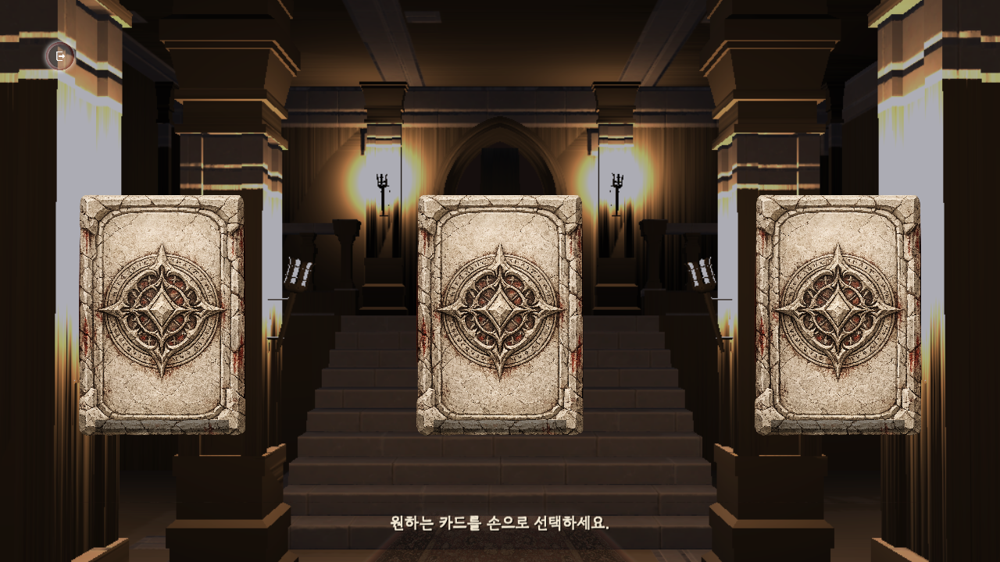
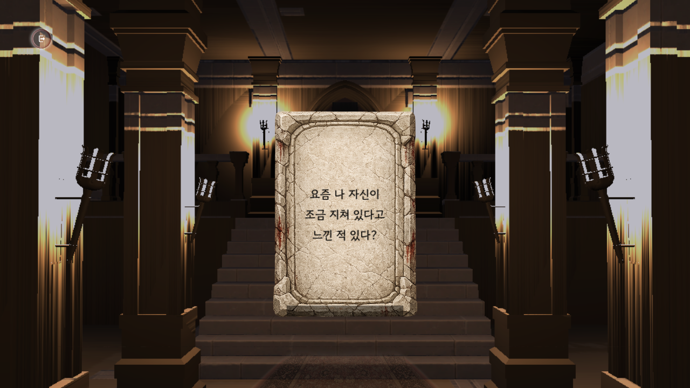
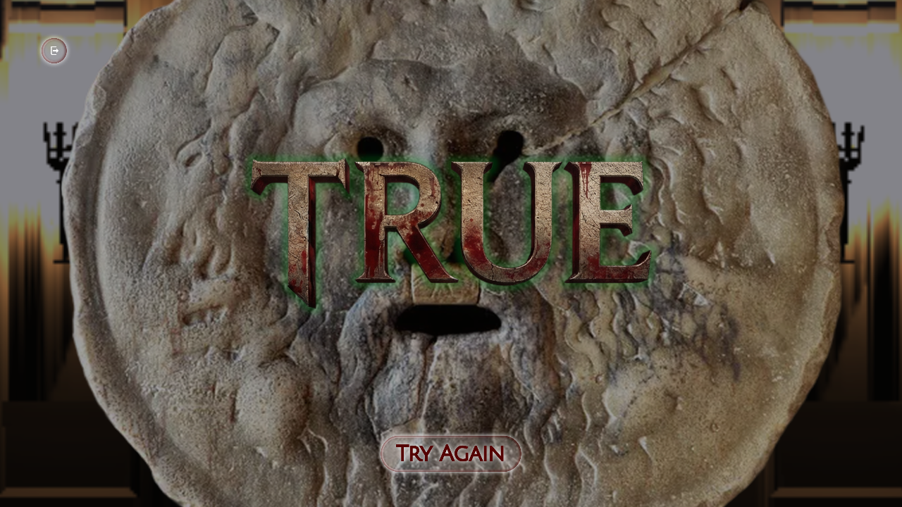

# Mouth of Truth

`Mouth of Truth`는 질문 카드 선택, 손 입력, 음성 답변, 얼굴 캡처를 하나의 의식처럼 이어 가는 인터랙티브 설치형 게임입니다. 참가자는 진실의 입 앞에서 질문을 고르고 답변합니다. 앱은 얼굴 표정과 음성 감정 신호를 결합해 `TRUE`, `FALSE`, `UNCERTAIN` 중 하나를 보여줍니다.

Unity는 게임 화면, Ultraleap 손 입력, 마이크 녹음, 웹캠 캡처를 담당합니다. Python 엔진은 얼굴/음성 분석 결과를 받아 최종 판정을 계산합니다.


## 프로젝트 성격

이 프로젝트의 `TRUE`, `FALSE`, `UNCERTAIN` 판정은 인터랙티브 설치 경험을 위한 게임 연출입니다. 얼굴 표정과 음성 신호는 참가자 반응을 극적으로 표현하기 위한 입력이며 실제 거짓말 탐지, 신뢰도 평가, 채용/심사/의사결정 근거로 사용하지 않습니다.

카메라와 마이크는 참가자에게 수집 목적을 알리고 동의를 받은 설치 환경에서만 사용합니다. 얼굴/음성 모델과 기준값은 데이터셋, 조명, 카메라 각도, 마이크 품질, 주변 소음에 영향을 받기 때문에 운영 전 현장 검증이 필요합니다.

답변 중 생성되는 얼굴 프레임과 음성 파일은 로컬 `python-engine/data/session-workspace/face-frames/`와 `python-engine/data/session-workspace/answer-audio/` 아래에 임시로 저장됩니다. 이 파일들은 분석 직후와 앱 시작/종료 시 정리됩니다. 디버깅을 위해 보존이 필요한 경우에는 별도 보존 정책을 추가한 뒤 참가자 고지와 운영 절차를 함께 갱신해야 합니다.

## 구현 범위

질문 카드 선택, Ultraleap 손 입력, 질문 내레이션, 음성 답변 수집, 웹캠 프레임 캡처, Python 분석 엔진 연동, macOS/Windows 릴리스 패키징 흐름까지 구현했습니다.

자동 검증은 게임 상태 머신, 판정 정책, Python 분석 계약, 릴리스 빌드 전제 조건처럼 하드웨어 없이 재현 가능한 경계를 중심으로 구성했습니다.

## 다운로드

현재 배포 빌드는 GitHub Releases에서 받을 수 있습니다.

- [Mouth of Truth v0.1.0 다운로드](https://github.com/potterLim/mouth-of-truth/releases/tag/v0.1.0)
- macOS: ZIP 배포본
- Windows: ZIP 배포본
- 포함 항목: Unity 앱, Python 분석 엔진, 필수 모델, 플랫폼별 Python 런타임

실행:

1. Ultraleap Hand Tracking Software를 설치하고 실행합니다.
2. Leap Motion 또는 Ultraleap 호환 장치를 연결합니다.
3. OS가 요청하는 카메라와 마이크 권한을 허용합니다.
4. macOS에서는 `Run Mouth of Truth.command`를 실행하고 Windows에서는 `Run Mouth of Truth.bat`을 실행합니다.

macOS와 Windows 배포본은 각 플랫폼에서 빌드해 확인했습니다.

## 주요 화면

| 카드 선택 | 질문 확인 |
| --- | --- |
|  |  |
| 손 삽입 | 판정 결과 |
|  |  |

## 플레이 흐름

1. 참가자가 손을 올려 시작합니다.
2. 세 장의 질문 카드 중 하나에 손을 잠시 머물러 선택합니다.
3. 선택된 질문을 듣고 마이크로 답변합니다.
4. 앱이 답변 중 음성 신호와 얼굴 프레임을 수집합니다.
5. Python 분석 엔진이 얼굴/음성 점수를 결합해 판정을 반환합니다.
6. 진실의 입이 `TRUE`, `FALSE`, `UNCERTAIN` 중 하나를 보여줍니다.

## 기술 스택

| 영역 | 기술 |
| --- | --- |
| Game | Unity 6000.4, C# |
| Input | Ultraleap Hand Tracking, microphone, webcam |
| Analysis | Python 3.11, PyTorch, torchaudio |
| Face | OpenCV, Ultralytics YOLO classification |
| Voice | wav2vec2 기반 음성 감정 분류 |
| Packaging | conda-pack, Unity build automation, GitHub Actions |

## 실행 준비

필수 환경:

```text
Unity Editor 6000.4.1f1
Git
Miniforge, Mambaforge, Anaconda 중 하나
conda-pack
Leap Motion 또는 Ultraleap 호환 장치
Ultraleap Hand Tracking Software
```

저장소를 받은 뒤 Unity Hub에서 `unity-app` 폴더를 엽니다. 저장소 루트가 아니라 Unity 프로젝트 폴더를 열어야 합니다.

```bash
git clone <repository-url>
cd mouth-of-truth

conda env create -f python-engine/environment.yml
conda activate mouth-of-truth
python -m compileall -q python-engine/src
PYTHONPATH=python-engine/src python -m unittest discover -s python-engine/tests
```

## 별도 복원 파일

아래 항목은 라이선스와 용량 때문에 Git에 포함하지 않습니다. 프로젝트 실행 또는 릴리스 빌드 전에 지정 위치에 복원합니다.

| 항목 | 위치 | 안내 |
| --- | --- | --- |
| 얼굴/음성 모델 묶음 | `python-engine/models/` | [모델 자산](python-engine/models/README.md) |
| Dungeon Modular Pack | `unity-app/Assets/ThirdParty/Environment/DungeonModularPack/` | [서드파티 자산과 런타임](THIRD_PARTY_ASSETS.md) |
| Persian Carpets URP | `unity-app/Assets/ThirdParty/Environment/PersianCarpetUrp/` | [서드파티 자산과 런타임](THIRD_PARTY_ASSETS.md) |
| Ultraleap Hand Tracking Software | 실행 PC | [서드파티 자산과 런타임](THIRD_PARTY_ASSETS.md) |
| Python 실행 환경 묶음 | `python-runtime/`, `python-runtime-windows/` | 릴리스 빌드 때 생성 |

모델 묶음 복원:

```bash
tools/restore-model-assets.sh <path-to>/mouth-of-truth-models-required.tar.gz
```

Windows PowerShell:

```powershell
.\tools\restore-model-assets.ps1 -ModelBundlePath <path-to>\mouth-of-truth-models-required.tar.gz
```

## 릴리스 자동화

Release workflow를 수동 실행하고 `v0.1.0` 같은 tag 이름을 입력하면 macOS/Windows 빌드를 만들고 draft GitHub Release에 asset을 업로드합니다.

모델과 Unity Asset Store 자산은 공개 Git에 넣지 않습니다. 비공개 asset bundle URL과 접근 토큰을 GitHub Actions secret으로 제공하며 빌드 중 필수 모델의 SHA-256을 확인합니다.

## 판정 정책

Python 브리지 기준:

- 얼굴 증거와 음성 증거가 모두 있으면 `TRUE` 또는 `FALSE`
- 얼굴 또는 음성 증거가 부족하면 `UNCERTAIN`
- 얼굴 점수 가중치: `0.80`
- 음성 점수 가중치: `0.20`
- 최종 결합 점수 `< 33.0`: `TRUE`
- 최종 결합 점수 `>= 33.0`: `FALSE`

수정 위치:

```text
python-engine/src/mouth_of_truth/fusion/judgment_policy.py
python-engine/src/mouth_of_truth/fusion/multimodal_fusion.py
python-engine/src/mouth_of_truth/fusion/verdict_policy.py
unity-app/Assets/Scripts/Game/Analysis/DeterministicAnswerAnalysisClient.cs
```

## 검증

하드웨어 없이 확인 가능한 검증:

```bash
tools/run-quality-checks.sh
```

개별 명령:

```bash
python -m compileall -q python-engine/src
PYTHONPATH=python-engine/src python -m unittest discover -s python-engine/tests
dotnet build unity-app/MouthOfTruth.Game.csproj /m:1
dotnet build unity-app/Assembly-CSharp-Editor.csproj /m:1
dotnet build unity-app/MouthOfTruth.Editor.Tests.csproj /m:1
dotnet format unity-app/MouthOfTruth.Game.csproj --verify-no-changes --severity error --no-restore
dotnet format unity-app/MouthOfTruth.Editor.Tests.csproj --verify-no-changes --severity error --no-restore
```

Unity EditMode 테스트:

```bash
/Applications/Unity/Hub/Editor/6000.4.1f1/Unity.app/Contents/MacOS/Unity \
  -batchmode \
  -nographics \
  -projectPath unity-app \
  -runTests \
  -testPlatform EditMode \
  -testResults /tmp/mouth-of-truth-editmode-results.xml
```

로컬에서 같은 검사를 스크립트로 실행할 때:

```bash
UNITY_EDITOR_PATH=/Applications/Unity/Hub/Editor/6000.4.1f1/Unity.app/Contents/MacOS/Unity \
  tools/run-unity-editmode-tests.sh
```

Release workflow는 Python 테스트와 Unity EditMode 테스트를 통과한 뒤에만 macOS/Windows 빌드를 생성합니다.

## 분석 런타임 설정

기본 분석 모드는 `auto`입니다. Python 브리지가 있으면 Python 분석을 사용합니다. 브리지가 없으면 deterministic 분석을 사용합니다.

```bash
export MOUTH_OF_TRUTH_ANALYSIS_MODE=auto
export MOUTH_OF_TRUTH_ANALYSIS_MODE=python
export MOUTH_OF_TRUTH_ANALYSIS_MODE=deterministic
```

분석 중 Python 브리지가 실패했을 때 기본 정책은 `fail-fast`입니다. 출시 환경에서 조용히 다른 판정기로 바뀌지 않게 하기 위한 설정입니다. 개발/전시 리허설 환경에서 deterministic fallback이 필요할 때만 명시적으로 켭니다.

```bash
export MOUTH_OF_TRUTH_ANALYSIS_FAILURE_POLICY=fail-fast
export MOUTH_OF_TRUTH_ANALYSIS_FAILURE_POLICY=deterministic
```

Ultraleap 손 입력, 마이크 녹음, 웹캠 캡처, 실제 모델 지연 시간은 장비가 연결된 Unity 실행 환경에서 별도로 확인합니다.

## 프로젝트 구조

```text
unity-app/        Unity 프로젝트, 게임 화면, 입력, 빌드 자동화
python-engine/    얼굴/음성 분석 엔진, Python 브리지, 판정 정책
bridge/           Unity와 Python이 JSON 요청/결과를 교환하는 런타임 폴더
python-engine/data/session-workspace/  답변 오디오와 얼굴 프레임 임시 작업 폴더
tools/            모델 복원, 모델 패키징, 릴리스 빌드 스크립트
docs/             프로젝트 설정과 릴리스 빌드 문서
```

## 문서

- [프로젝트 설정과 릴리스 빌드](docs/setup-and-release.md)
- [모델 학습 데이터셋과 재현 기준](docs/model-training-and-datasets.md)
- [서드파티 자산과 런타임](THIRD_PARTY_ASSETS.md)
- [모델 자산](python-engine/models/README.md)

릴리스 빌드는 필수 Python 실행 파일과 모델 SHA-256을 자동으로 확인합니다. 필수 자산이 없거나 검사값이 맞지 않으면 빌드가 중단됩니다.
